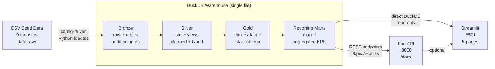

# CommercePulse

> An end-to-end e-commerce analytics platform — from raw CSV ingestion to an
> interactive multi-page dashboard — built with Python, DuckDB, dbt, FastAPI,
> and Streamlit.

[](https://github.com/robertogonzalez-dev/CommercePulse/actions/workflows/ci.yml)
[](https://www.python.org/downloads/)
[](https://docs.getdbt.com/)
[](https://docs.docker.com/compose/)
[](LICENSE)

---

## Overview

CommercePulse models a realistic e-commerce company across **9 data domains**
(customers, products, orders, payments, refunds, inventory, web sessions,
marketing spend). The full pipeline runs in under 5 minutes locally or with a
single `docker compose up`.

| What you get | Details |
|---|---|
| **Bronze layer** | 9 audited DuckDB tables with row hashing, batch IDs, and retry logic |
| **Silver layer** | 11 dbt staging views — typed, deduplicated, normalised |
| **Gold layer** | 7 fact tables + 6 dimensions (star schema) + 6 reporting marts |
| **REST API** | 7 FastAPI services — KPIs, sales, customers, products, channels, inventory, refunds |
| **Dashboard** | 5-page Streamlit app with Plotly visualisations and date-range filters |
| **Quality gate** | 205 dbt tests + pytest suite, all enforced in CI |

---

## Architecture



---

## Tech Stack

| Layer | Tool | Purpose |
|---|---|---|
| Ingestion | Python + pandas | Config-driven CSV → DuckDB bronze loader |
| Bronze | DuckDB | Raw, immutable, audited tables |
| Silver | dbt (staging) | Cleaned, typed, deduplicated models |
| Gold | dbt (marts) | Star schema — dimensions, facts, reporting |
| API | FastAPI + uvicorn | Parameterised metric endpoints |
| Dashboard | Streamlit + Plotly | Interactive multi-page analytics UI |
| Testing | pytest + httpx | Unit + integration test suite |
| CI/CD | GitHub Actions | Lint → type-check → test → dbt → Docker |
| Containers | Docker + Compose | Reproducible full-stack deployment |
| Scheduling | APScheduler | Daily pipeline automation |

---

## Quick Start — Docker (recommended, ~5 min)

**Prerequisites:** Docker Desktop

```bash
# 1. Clone
git clone https://github.com/robertogonzalez-dev/CommercePulse.git
cd CommercePulse

# 2. (Optional) copy env config
cp .env.example .env

# 3. Build images, run pipeline, start services
docker compose up
```

Once the pipeline container exits successfully, the API and dashboard auto-start:

| Service | URL |
|---|---|
| Streamlit dashboard | http://localhost:8501 |
| FastAPI (Swagger) | http://localhost:8000/docs |
| FastAPI (ReDoc) | http://localhost:8000/redoc |

```bash
# Re-run the pipeline on demand (e.g. after updating seed data)
make docker-pipeline

# Stop everything
make docker-down
```

---

## Quick Start — Local

**Prerequisites:** Python 3.11+, Git

```bash
# 1. Clone and enter repo
git clone https://github.com/robertogonzalez-dev/CommercePulse.git
cd CommercePulse

# 2. Create virtual environment
python -m venv .venv
source .venv/bin/activate          # Windows: .venv\Scripts\activate

# 3. Install dependencies
pip install -r requirements.txt

# 4. Copy environment config
cp .env.example .env

# 5. Run the full pipeline (ingestion + dbt transform)
bash scripts/entrypoint_pipeline.sh
# or step by step:
make ingest        # Bronze layer
make transform     # Silver + Gold

# 6. Start services (two separate terminals)
make api           # http://localhost:8000
make app           # http://localhost:8501
```

Expected pipeline output:

```
============================================================
CommercePulse Ingestion Pipeline
batch_id  : 3f7a1c2d-...
============================================================
   customers          status=success   loaded=25    duration=0.12s
   products           status=success   loaded=25    duration=0.08s
   inventory          status=success   loaded=25    duration=0.07s
   orders             status=success   loaded=30    duration=0.09s
   order_items        status=success   loaded=43    duration=0.08s
   payments           status=success   loaded=30    duration=0.08s
   refunds            status=success   loaded=5     duration=0.06s
   marketing_spend    status=success   loaded=12    duration=0.07s
   web_sessions       status=success   loaded=30    duration=0.11s
------------------------------------------------------------
Total: 9 datasets | 225 rows loaded | 0 failed
============================================================
```

---

## API Reference

The FastAPI server exposes interactive docs at `/docs`. Key endpoints:

```bash
# Health check
curl http://localhost:8000/health

# Revenue KPIs
curl "http://localhost:8000/kpis/revenue?start_date=2024-01-01&end_date=2024-12-31"

# Top products
curl "http://localhost:8000/reports/products?limit=10&order_by=revenue"

# Customer segments
curl http://localhost:8000/reports/customers/segments

# Channel performance
curl "http://localhost:8000/reports/channels?start_date=2024-01-01"

# Inventory risk
curl http://localhost:8000/reports/inventory/risk

# Refund analysis
curl "http://localhost:8000/reports/refunds?start_date=2024-01-01"
```

---

## Data Model

### Bronze (raw ingestion)

One table per source dataset, all suffixed with audit columns:

| Audit column | Description |
|---|---|
| `_ingested_at` | UTC timestamp of this load |
| `_batch_id` | UUID shared by all datasets in a single pipeline run |
| `_source_file` | Source CSV filename |
| `_row_hash` | SHA-256 of all business columns (change detection) |

### Gold — Star Schema

```
                    dim_date
                       │
dim_customer ──── fact_orders ──── dim_product
                       │
dim_channel ───────────┤
                       │
dim_region  ───────────┤
                       │
                  fact_order_items
                  fact_payments
                  fact_refunds
                  fact_marketing_spend
                  fact_inventory_snapshots
                  fact_sessions
```

### Reporting Marts

| Mart | Grain | Key metrics |
|---|---|---|
| `mart_sales_summary` | day | revenue, AOV, cancellation rate |
| `mart_channel_performance` | channel / day | revenue, ROAS, conversions |
| `mart_customer_ltv` | customer | LTV, repeat rate, first-touch channel |
| `mart_product_performance` | product | units sold, margin, return rate |
| `mart_inventory_risk` | SKU | overstock / understock flags |
| `mart_refund_analysis` | refund | reason, product, segment |

---

## Project Structure

```
CommercePulse/
├── .github/workflows/
│   └── ci.yml               # Lint -> test -> dbt compile -> Docker build
├── api/                     # FastAPI service
│   ├── routers/             # health, kpis, reports
│   ├── services/            # 7 domain services
│   ├── models/              # Pydantic response schemas
│   └── db/connection.py     # Thread-local DuckDB connections
├── app/                     # Streamlit dashboard
│   ├── pages/               # 5 pages (Orders, Customers, Products, Marketing, Inventory)
│   ├── components/          # charts.py, filters.py, kpi_cards.py
│   └── db.py                # Cached DuckDB queries
├── data/
│   ├── raw/                 # 9 seed CSV files (tracked in git)
│   └── warehouse/           # DuckDB file (auto-created, gitignored)
├── ingestion/
│   ├── config/              # 9 per-dataset YAML configs
│   ├── loaders/             # BaseLoader template + custom subclasses
│   ├── schema/bronze_ddl.sql
│   ├── pipeline.py          # Orchestrator
│   ├── scheduler.py         # APScheduler for daily automation
│   ├── validator.py         # Schema + quality checks
│   └── warehouse.py         # DuckDB connection manager
├── scripts/
│   └── entrypoint_pipeline.sh  # Ingestion + dbt entrypoint (used by Docker)
├── transform/dbt_project/
│   ├── models/
│   │   ├── staging/         # 11 silver views
│   │   ├── intermediate/    # 2 reusable business logic models
│   │   └── marts/           # 14 gold tables (core + reporting)
│   ├── tests/               # 205 dbt tests
│   └── profiles.yml         # DuckDB connection (env_var override supported)
├── tests/                   # pytest suite
├── Dockerfile.pipeline      # Ingestion + dbt container
├── Dockerfile.api           # FastAPI container
├── Dockerfile.streamlit     # Streamlit container
├── docker-compose.yml       # Full-stack orchestration
├── Makefile                 # 25+ dev targets
└── run_pipeline.py          # CLI entry point
```

---

## CI/CD Pipeline

Three parallel jobs run on every push and pull request:

```
push / PR
    │
    ├── Lint · Type Check · Test
    │       ruff check + format
    │       mypy ingestion/ api/
    │       pytest (unit + integration)
    │
    ├── dbt Validate           (needs: lint-test)
    │       initialise Bronze schema
    │       run ingestion pipeline
    │       dbt deps + compile + run + test
    │
    └── Docker Build Validation (needs: lint-test)
            build Dockerfile.pipeline
            build Dockerfile.api
            build Dockerfile.streamlit
            (images pushed on merge to main — configure registry in ci.yml)
```

---

## Deployment Options

| Platform | Services | Cost | Notes |
|---|---|---|---|
| **Docker Compose (local)** | All | Free | Best for demos and dev |
| **Render.com** | API + Streamlit | Free tier | Static IP for Streamlit; ephemeral disk |
| **Railway.app** | API + Streamlit | ~$5/mo | Easiest cloud deploy; Docker-native |
| **Fly.io** | API + Streamlit | Free tier | Global edge; persistent volumes available |
| **AWS ECS Fargate** | All | ~$15/mo | Production-grade; EFS for DuckDB persistence |
| **MotherDuck** | DuckDB | Free tier | Managed cloud DuckDB — drop-in for `CP_DB_PATH` |

> **DuckDB + cloud tip:** For any cloud deployment, set `CP_DB_PATH` to an EFS
> mount path (AWS) or a persistent volume path. For a fully serverless setup,
> swap DuckDB for [MotherDuck](https://motherduck.com) — the dbt-duckdb adapter
> supports it with a single connection string change.

---

## Pipeline Automation

Run the pipeline daily at 02:00 UTC (local):

```bash
make schedule
# or:
SCHEDULE_HOUR=6 SCHEDULE_MINUTE=0 python -m ingestion.scheduler
```

For server deployments, the scheduler runs inside the pipeline container.
Add it to `docker-compose.yml` with `restart: always` and remove `restart: "no"`.

---

## Adding a New Dataset

1. Drop the CSV in `data/raw/your_dataset.csv`

2. Create `ingestion/config/your_dataset.yaml`:

```yaml
dataset: your_dataset
source_file: data/raw/your_dataset.csv
target_schema: bronze
target_table: raw_your_dataset
load_type: incremental       # full | incremental
primary_key: id
watermark_column: updated_at # null for full loads
expected_columns: [id, name, value, updated_at]
not_null_columns: [id]
unique_columns: [id]
```

3. Add the `CREATE TABLE IF NOT EXISTS` block to `ingestion/schema/bronze_ddl.sql`

4. Run: `python run_pipeline.py --datasets your_dataset`

No Python changes required for standard CSV sources.

---

## Makefile Targets

```
make install          Install dependencies
make ingest           Run full ingestion pipeline
make ingest-dataset   Run one dataset  (DATASET=orders)
make ingest-debug     Run with DEBUG logging
make list-datasets    Print all registered datasets
make transform        Run all dbt models
make transform-test   Run dbt tests (205 tests)
make transform-docs   Generate and serve dbt docs (localhost:8080)
make api              Start FastAPI server      (localhost:8000)
make app              Start Streamlit dashboard (localhost:8501)
make docker-build     Build all Docker images
make docker-up        Run full stack via Docker Compose
make docker-down      Stop and remove containers
make docker-pipeline  Re-run pipeline container only
make docker-logs      Tail logs from all containers
make schedule         Start daily pipeline scheduler (02:00 UTC)
make test             Run pytest
make lint             Run ruff linter + format check
make typecheck        Run mypy
make clean            Remove caches and logs
```

---

## Security Notes

- All secrets and config are loaded from environment variables (prefix `CP_`)
  via **pydantic-settings** — never hardcoded.
- `.env` is gitignored; `.env.example` ships safe defaults.
- Docker images run as a **non-root user** (uid 1001).
- API and Streamlit containers mount the warehouse volume **read-only**.
- CORS origins are explicitly allowlisted via `CP_CORS_ORIGINS`.

---

## Interview Talking Points

<details>
<summary><strong>Engineering patterns demonstrated</strong></summary>

- **Template Method pattern** — `BaseLoader` defines the load lifecycle
  (`read → validate → transform → write → log`); subclasses override only what
  changes (e.g. `WebSessionsLoader` computes `session_duration_seconds`).
- **Config-driven architecture** — adding a new data source requires a YAML
  file and a DDL statement, zero Python changes.
- **Incremental loading with high-water marks** — `get_max_watermark()` queries
  the bronze table before each run; only newer rows are appended.
- **Audit trail** — every row carries `_ingested_at`, `_batch_id`,
  `_source_file`, `_row_hash` for full lineage and change detection.
- **Retry with linear back-off** — `_write_with_retry()` retries DuckDB writes
  3× (2 s / 4 s / 6 s) before failing the batch.
- **Star schema design** — 7 facts + 6 dimensions make the gold layer
  compatible with any BI tool (Tableau, Power BI, Metabase).
- **Dependency injection** — FastAPI uses thread-local DuckDB connections
  managed via `Depends()`, keeping the API stateless and testable.

</details>

<details>
<summary><strong>Why these technology choices?</strong></summary>

- **DuckDB** — in-process OLAP engine; zero infrastructure overhead while
  supporting full SQL, window functions, and Parquet I/O. Ideal for portfolios
  and small-to-medium analytical workloads.
- **dbt** — industry-standard SQL transformation layer; enforces modular,
  testable, documented models. The 205-test suite catches data quality regressions
  automatically.
- **FastAPI** — async-native, automatically generates OpenAPI docs, and
  Pydantic models make request/response contracts explicit and validated.
- **Streamlit** — rapid dashboard development with Python only; `@st.cache_data`
  makes repeated queries cheap without a separate caching layer.
- **APScheduler** — lightweight (no Airflow/Prefect overhead) for a single-node
  portfolio; easily swappable for a proper orchestrator as scale demands.

</details>

<details>
<summary><strong>How you would scale this beyond the portfolio</strong></summary>

- **Replace DuckDB** with Snowflake / BigQuery / Redshift when data volume
  exceeds single-machine RAM, or use **MotherDuck** for a zero-infra upgrade path.
- **Add Airflow / Prefect** as the orchestrator when dependencies between
  pipelines grow beyond a single `entrypoint_pipeline.sh`.
- **Add data contracts** using Pydantic or `great-expectations` at the ingestion
  boundary to enforce upstream schema guarantees.
- **Materialise incrementally** — the dbt Gold layer currently does full
  refreshes; add `is_incremental()` blocks on the fact tables to reduce
  compute on large datasets.
- **Add authentication** — FastAPI supports OAuth2/JWT via `fastapi-users`;
  Streamlit supports session state + a login page or `streamlit-authenticator`.

</details>

---

## Implementation Phases

| Phase | Status | Description |
|---|---|---|
| 1 | ✅ Complete | Blueprint & data model design |
| 2 | ✅ Complete | Config-driven Bronze ingestion pipeline |
| 3 | ✅ Complete | Silver/Gold dbt models — star schema + 205 tests |
| 4 | ✅ Complete | FastAPI analytics layer + Streamlit dashboard |
| 5 | ✅ Complete | Docker, CI/CD, scheduling, observability |

---

## License

MIT — see [LICENSE](LICENSE).
